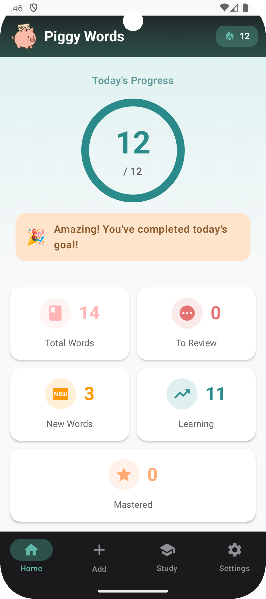
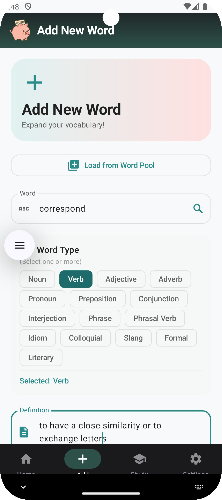
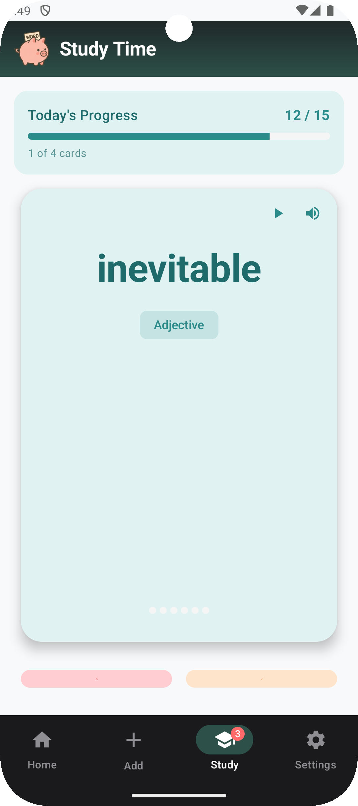
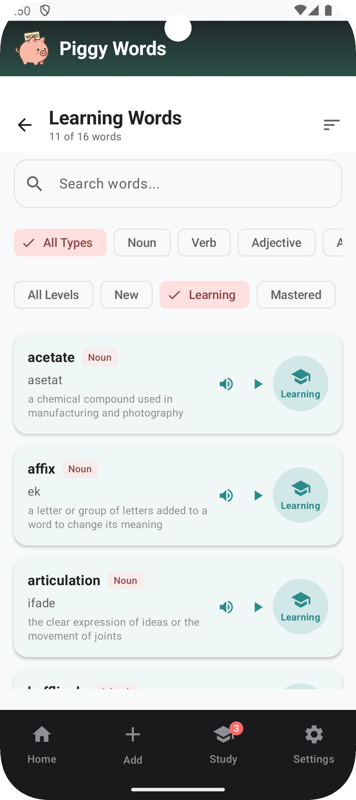
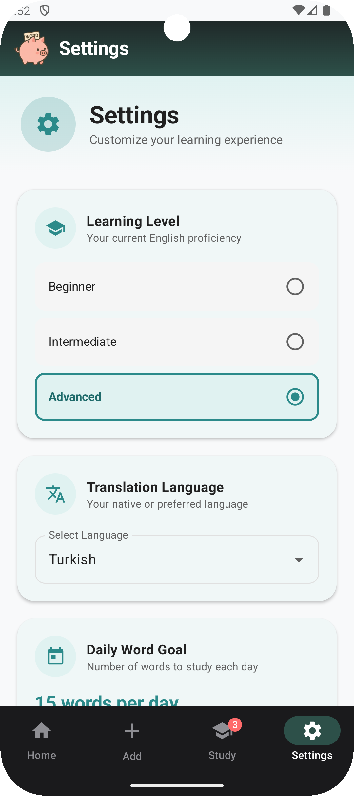

# PiggyWords


> 🐷 Learn English vocabulary with smart flashcards and spaced repetition

**PiggyWords** is an open-source Android flashcard application designed for learning English vocabulary using a spaced repetition algorithm. The app is completely offline, ad-free, and respects your privacy.

---

## ✨ Features

### Core Learning
- 🧠 **Spaced Repetition Algorithm** - Smart review scheduling based on 2^learningLevel formula
- 📚 **Flash Card Study Mode** - Interactive card flipping with front/back views
- 📝 **Example Sentences** - Every word includes a real-world usage example (Future)
- 🎯 **Daily Study Limits** - Configurable daily goals
- 📊 **Progress Tracking** - Monitor your learning streak and total words studied

### Word Management
- ➕ **Add Custom Words** - Create your own vocabulary with definitions and translations
- 🖼️ **Image Support** - Add images from gallery to enhance memorization
- 🏷️ **Multiple Word Types** - Support for 15 types: Noun, Verb, Adjective, Phrasal Verb, Idiom, and more

### Design & Experience
- 🎨 **Material Design 3** - Modern, clean interface
- 📱 **100% Jetpack Compose** - Modern Android UI toolkit
- 🔒 **Offline-First** - No internet connection required
- 🚫 **No Ads, No Tracking** - Your privacy matters

---

## 📸 Screenshots






---

## 📥 Installation

### From GitHub Releases
Download the latest APK from [Releases](https://github.com/ilyassari/piggywords/releases)

### From F-Droid (Coming Soon)
[](https://f-droid.org/packages/com.ellez.piggywords)

---

## 🛠️ Technical Details

### Built With
- **Language:** Kotlin 2.0.0
- **UI Framework:** Jetpack Compose (100% Compose, no XML)
- **Architecture:** MVVM Pattern
- **Database:** Room Database (local storage)
- **Minimum SDK:** 24 (Android 7.0 Nougat)
- **Target SDK:** 34 (Android 14)
- **Design System:** Material Design 3

### Key Libraries
- `androidx.compose:compose-bom:2024.06.00` - Compose UI toolkit
- `androidx.room:room-ktx:2.6.1` - Local database
- `androidx.navigation:navigation-compose:2.7.7` - Navigation
- `io.coil-kt:coil-compose:2.7.0` - Image loading
- `com.google.code.gson:gson:2.10.1` - JSON parsing

---

## 🏗️ Building from Source

### Prerequisites
- Android Studio Hedgehog (2023.1.1) or later
- JDK 17
- Android SDK 35
- Gradle 8.9

### Clone and Build
```bash
# Clone repository
git clone https://github.com/ilyassari/piggywords.git
cd piggywords

# Build debug APK
./gradlew assembleDebug

# Build release APK
./gradlew assembleRelease

# Install on connected device
./gradlew installDebug
```

The APK will be generated in:
- Debug: `app/build/outputs/apk/debug/app-debug.apk`
- Release: `app/build/outputs/apk/release/app-release.apk`

---

## 📖 How It Works

### Spaced Repetition Algorithm
PiggyWords uses the formula: `Next Review = Today + Base^(learningLevel) days`

The base multiplier is adjustable in settings (default: 2). Example progression with default settings:
- Level 0: 1 day → Level 1: 2 days → Level 2: 4 days → Level 3: 8 days

Marking words as "Known" increases the level, while "Unknown" decreases it (minimum 0).


---

## 🐛 Known Issues

- No backup functionality yet
- No push notification system
- Adding pictures have no effect

For bug reports and feature requests, please open an issue on [GitHub Issues](https://github.com/ilyassari/piggywords/issues).

---

## 📄 License

This project is licensed under the **GNU General Public License v3.0** - see the [LICENSE](LICENSE) file for details.

### What this means:
- ✅ You can use, modify, and distribute this software freely
- ✅ You can use it for commercial purposes
- ⚠️ If you distribute modified versions, you must also open-source them under GPL-3.0
- ⚠️ You must include the original copyright and license notice

---


## 📞 Contact

- **GitHub:** [@ilyassari](https://github.com/ilyassari)
- **Issues:** [Report a bug](https://github.com/ilyassari/piggywords/issues/new)

---

## 📊 Project Status

🚧 **Beta Version (0.1.0)** - Currently in active development and testing phase.

[](https://github.com/ilyassari/piggywords/releases)
[](https://github.com/ilyassari/piggywords/issues)
[](https://github.com/ilyassari/piggywords/commits/main)

---


**Made with ❤️ for language learners**
